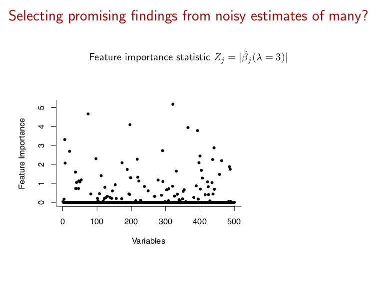
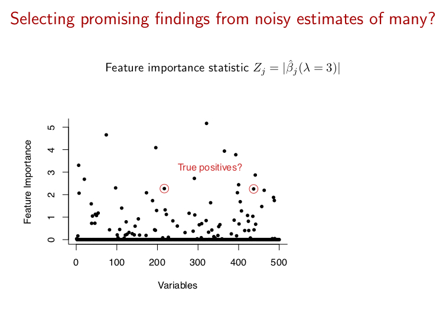
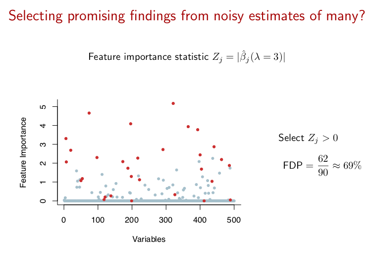
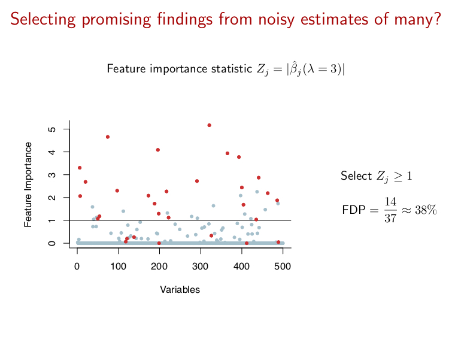
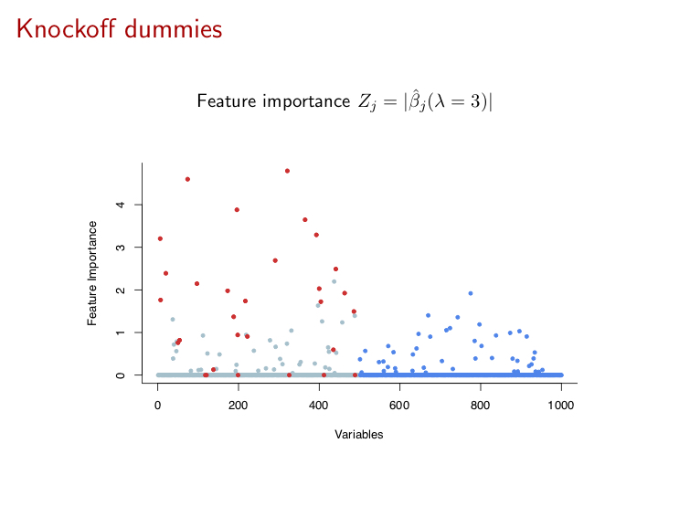
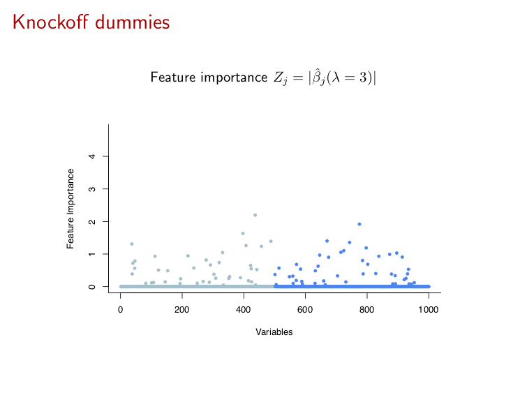
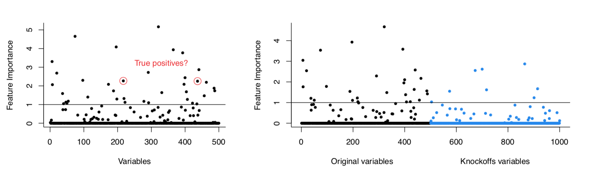
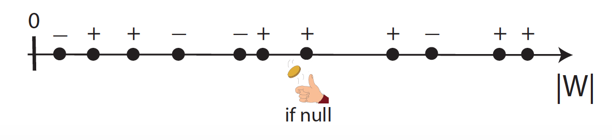
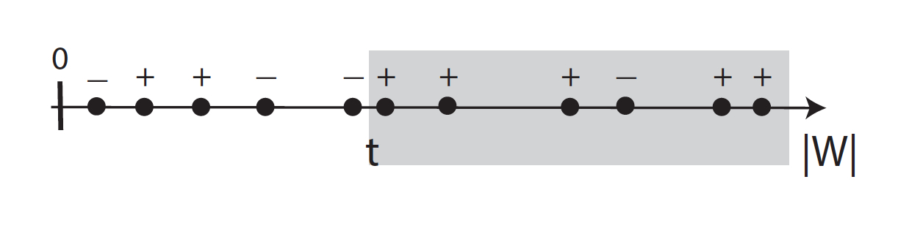

```{r startup, include = FALSE, message = FALSE, warning = FALSE}
knitr::opts_chunk$set(echo = T, 
                      eval=T, 
                      message=F, 
                      warning=F, 
                      error=F, 
                      comment=NA, 
                      cache=F, 
                      R.options=list(width=220))
```


# Outline


* Knockoffs

---

# Acknowledgments

The material for this lecture is borrowed from [Stats 300C: Theory of Statistics](https://statweb.stanford.edu/~candes/stats300c/) - Lectures 11 and 12 (April 25, 2018) by [Emmanuel Candès](https://en.wikipedia.org/wiki/Emmanuel_Cand%C3%A8s) 

---

# The problem

* We have a response $Y$, which potentially depends on
thousands of variables $X_1,\ldots,X_p$

* We define a *null* variable to be one for which
$$Y \perp X_j | X_{-j}$$
that is, $X_j$ is not associated with $Y$ given all the other variables $\{X_1,\ldots,X_p\} \setminus X_j$

* We denote the subset of null variables by $\mathcal{H}_0 \subseteq \{1,\ldots,p\}$ and call the $j$th variable *relevant* (or non-null) if $j\notin \mathcal{H}_0$

* In particular, if the likelihood of $Y$ follows a GLM, then $Y \perp X_j | X_{-j}$ if and only if $\beta_j=0$. Hence $\mathcal{H}_0 = \{j: \beta_j=0\}$

* We would like a method which selects relevant variables without selecting too many null variables

---

# Variable importance statistics

* Many variable selection methods are available which compute for each variable an *importance statistic* which serves as a basis for including a variables in our model or not

* For example, the variable importance statistic may be 
    - the magnitude of a coefficient computed with the Lasso
    - the point at which a variable enters the Lasso path
    - feature importance statistics computed with random forests or neural nets
    - Posterior probability calculated according some Bayesian model
    - etc.

* It is difficult to do inference with these selection methods because the sampling distribution of the variable importance statistics is extremely complicated and not known

---

* For simplicity, consider for a moment the typical example of the lasso

* Intuitively, it seems reasonable to select variables whose fitted coefficient is (in absolute value) above some significance threshold


* However, it is not an easy task to choose the threshold (or the value of $\lambda$) in such a way as to control Type-I errors (select null variables)

---



From E. Candès, The 2017 Wald Lectures, Joint Statistical Meetings, Baltimore, August 2017

---




---



---



---

# Dummy variables

* Suppose we select variables $X_j$ such that the importance statistic is larger than some *threshold* $T$

* What we would like to know is how many nulls are among the selected variables

* The difficulty is that we have no reference null variables with which to calibrate $T$

* One idea is to create *dummy variables*, i.e. null variables which preserve some of the structure of the real variables

* In this lecture, we introduce *knockoffs* dummies
which imitate the actual data in a way that allows us to control the FDR

---



From E. Candès, The 2017 Wald Lectures, Joint Statistical Meetings, Baltimore, August 2017


---



---

# How do the nulls look like?



We know the dummies are null and hope that because they preserve some of
the structure of the real variables, the number of dummy variables selected by our method will be a good estimate for the number of nulls among the real variables which were selected

---

# The construction of the knockoffs

* A rigorous definition of knockoffs depends on some additional modeling choices, but intuitively their nature can be understood as follows

* **What knockoffs are**. For each variable $X_j$, we construct a knockoff copy $\tilde{X}_j$ such that

  1. the correlation between distinct knockoffs $\tilde{X}_j$ and $\tilde{X}_k$ is the same as the correlation between $X_j$ and $X_k$

  2. the correlation between $X_j$ and $\tilde{X}_k$ is the same as the correlation between $X_j$ and $X_k$

  3. the knockoffs are created without looking at $Y$

* **What knockoffs do**. Knockoffs can be used as negative controls for the original variables. The true importance of a variable $X_j$
 can be deduced by comparing its predictive power for $Y$ to that of its knockoff copy $\tilde{X}_j$
 
---

# Knockoff scores

* Having constructed the knockoffs, we can proceed by applying a traditional variable selection procedure on the augmented set of predictors
$$[\,\,X \,\, \tilde{X}\,\,]$$

* For each $j=1,\ldots,p$ we compute statistics $Z_j$ and $\tilde{Z}_j$ measuring the importance of $X_j$ and $\tilde{X}_j$ respectively, in explaining $Y$

* For instance, we can apply the lasso on the augmented data and compute:
$$Z_j = |\hat{\beta}_j(\lambda)|, \quad \tilde{Z}_j = |\hat{\beta}_{j+p}(\lambda)|$$

* The knockoff filter works by comparing the $Z_j$'s to the $\tilde{Z}_j$'s and selecting only variables that are clearly better than their knockoff copy. A simple example may be the *knockoff score*
$$W_j = Z_j - \tilde{Z}_j$$
but many other alternatives are possible

---

* The figure below shows one realization of the random vector $(Z,\tilde{Z})$, and it seems apparent that the nulls (black dots) are distributed symmetrically around the diagonal

```{r, echo=FALSE, fig.align = 'center', out.width = '60%', out.height = '60%'}
knitr::include_graphics("http://web.stanford.edu/group/candes/knockoffs/images/square.png")
```

* For the non-nulls (red dots) on the other hand, we see a propensity for $Z_j$ to be larger than its control value $\tilde{Z_j}$ (points below the diagonal)

---

The knockoff procedure selects predictors with large and positive values of $W_j$ according to the adaptive threshold defined as
$$T = \min\left\{t: \frac{1+\#\{j:W_j \leq -t\}}{\#\{j:W_j \geq t\}} \leq \alpha\right\}$$
where $\alpha$ is the (desired) target FDR level

```{r, echo=FALSE, fig.align = 'center', out.width = '60%', out.height = '60%'}
knitr::include_graphics("http://web.stanford.edu/group/candes/knockoffs/images/square_sel.png")
```

---

# Coin-flipping property

* A large positive value of $W_j$ provides some evidence that the distribution of $Y$ depends upon $X_j$, whereas
under the null $W_j$ has a *symmetric* distribution around 0: if $j\in \mathcal{H_0}$, then for $t>0$
$$ \Pr(W_j \leq -t) \stackrel{d}{=} \Pr(W_j \geq t)$$

* Conditional on $(|W_1|,\ldots,|W_p|)$, the signs of the null $W_j$'s with $j\in \mathcal{H}_0$ are i.i.d. coin flips



---

# FDP estimation

* It follows that the null
statistics $W_j$ are symmetric and that for any fixed threshold $t>0$
$$\#\{j: W_j \leq -t \} \geq \#\{\mathrm{null\,\,}j: W_j \leq -t \}\stackrel{d}{=} \#\{\mathrm{null\,\,}j: W_j \geq t \}$$

* Imagine then selecting those variables such that $W_j\geq t$, then the false discovery proportion (FDP)
$$\mathrm{FDP}(t) = \frac{\#\{\mathrm{null\,\,}j: W_j \geq t \}}{\#\{j: W_j \geq t \}}$$
can be estimated as
$$\widehat{\mathrm{FDP}}(t) = \frac{\#\{j: W_j \leq - t \}}{\#\{j: W_j \geq t \}}$$

---

# FDR control

The procedure selecting the variables
$$\hat{\mathcal{S}} = \{j: W_j \geq T\}$$
with 
$$T = \min\left\{t: \frac{1+\#\{j:W_j \leq -t\}}{\#\{j:W_j \geq t\}} \leq \alpha\right\}$$
controls the FDR at level $\alpha$:
$$\mathbb{E} \left(\frac{\#(\hat{\mathcal{S}} \cap \mathcal{H}_0)}{\# \hat{\mathcal{S}}}\right) \leq \alpha$$



---

# Fixed-X vs Model-X

* Knockoff methodology includes two variants:

  1. Fixed-X knockoffs
  
  2. Model-X knockoffs

* We will discuss Model-X knockoffs only

* In Model-X setting, we assume that we have $n$ i.i.d. samples $(Y_i,X_i),i=1,\ldots,n$ from $(Y,X)$

* We further assume that the distribution of $X$ is known, while the distribution of $Y|X$ is completely unknown

---

# Knockoffs for Gaussian variables


* We show how to construct model-X knockoffs $\tilde{X}$ for Gaussian variables

* Suppose $X$ is distributed as $N(\mu,\Sigma)$

* Construct knockoffs such that the joint distribution of $(X,\tilde{X})$ is Gaussian:
$$N(
\left[\begin{array}{c}
 \mu  \\ 
 \mu  \\ 
\end{array}\right],\left[\begin{array}{cc}
 \Sigma & \Sigma - diag(s)  \\ 
 \Sigma - diag(s) & \Sigma   \\ 
\end{array}\right])$$
where $s$ is chosen such that the covariance matrix of $(X,\tilde{X})$ is positive definite

---

```{r}
set.seed(123)
# Problem parameters
n = 100          # number of observations
p = 100          # number of variables
k = 20            # number of variables with nonzero coefficients
amplitude = 4.5   # signal amplitude (for noise level = 1)

# Generate the variables from a multivariate normal distribution
mu = rep(0,p)
rho = 0.25
Sigma = toeplitz(rho^(0:(p-1)))
X = matrix(rnorm(n*p),n) %*% chol(Sigma)

# Generate the response from a linear model
nonzero = sample(p, k)
beta = amplitude * (1:p %in% nonzero) / sqrt(n)
y.sample = function(X) X %*% beta + rnorm(n)
y = y.sample(X)
```

---

# True knockoffs

This construction generate knockoffs using the true model parameters $\mu$ and $\Sigma$

```{r}
library(knockoff)
gaussian_knockoffs = function(X) create.gaussian(X, mu, Sigma)
result = knockoff.filter(X, y,knockoffs=gaussian_knockoffs, fdr = 0.1)
print(result)
fdp = function(selected) sum(beta[selected] == 0) / max(1, length(selected))
fdp(result$selected)
```

---

# Estimated knockoffs

This construction estimates from the data the mean $\mu$ and the covariance $\Sigma$ of the rows of $X$, instead of using the true parameters from which the variables were generated

```{r}
result = knockoff.filter(X, y, fdr = 0.1)
print(result)
fdp(result$selected)
```

