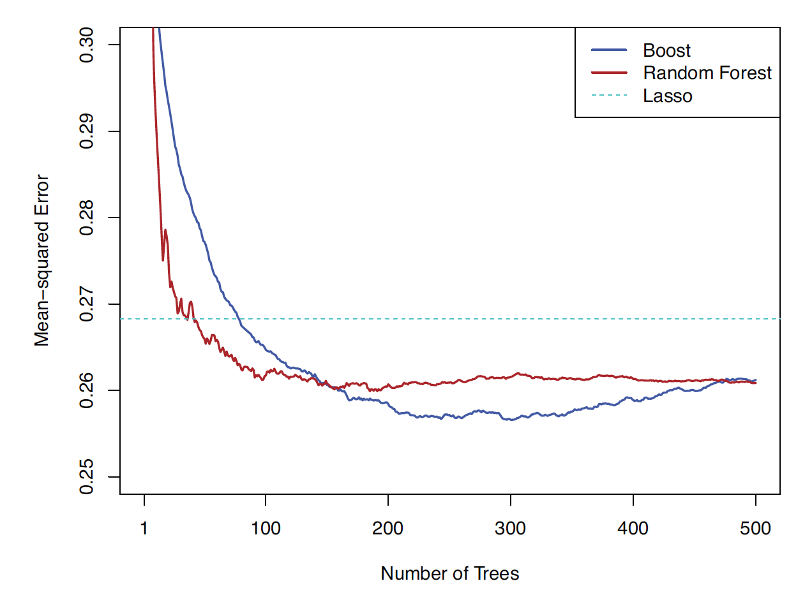
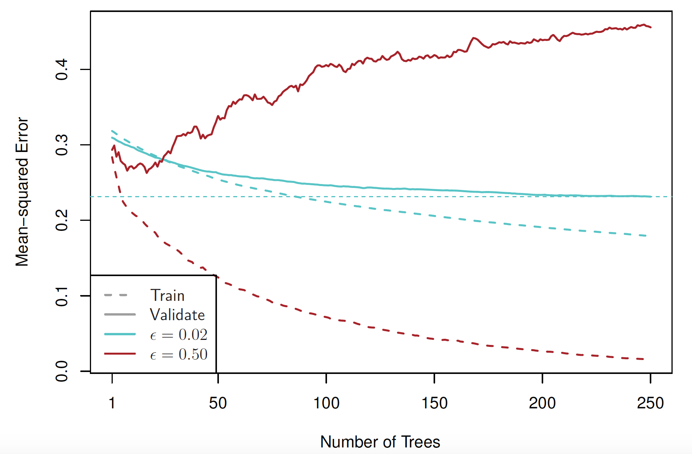
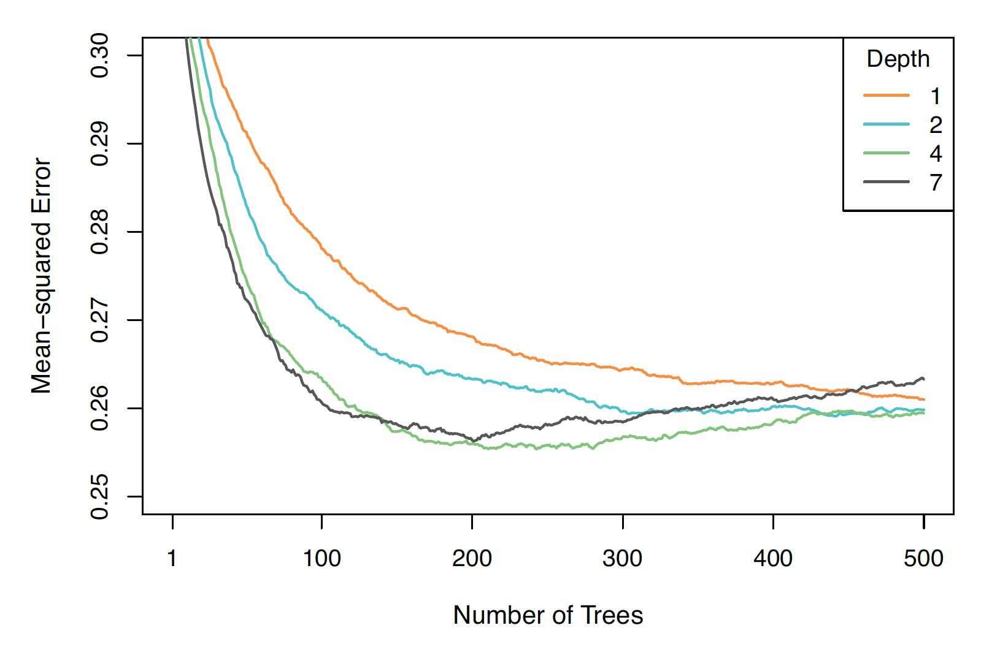
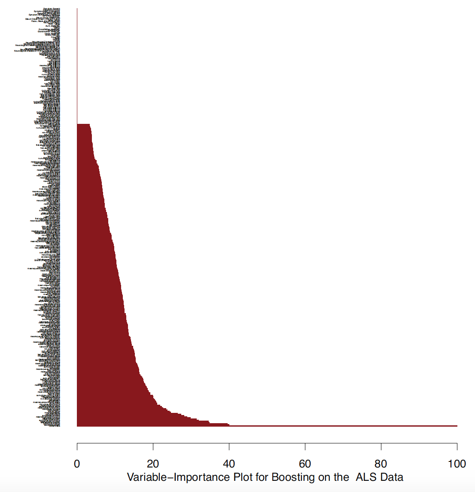

```{r startup, include = FALSE, message = FALSE, warning = FALSE}
knitr::opts_chunk$set(echo = T, eval=T, message=F, warning=F, error=F, 
                      comment=NA, cache=F, R.options=list(width=220),
                      fig.align='center', out.width='60%', fig.asp=.7)
```


# Outline

* Boosting

* L2-boosting

---

# Boosting

* Boosting starts by fitting a __base learner__ to the training data

* Next the base learner is re-fitted, but with __more
weight__ (importance) given to badly fitted/misclassified observations

* This process is repeated until some stopping rule is reached

* We will discuss the following algorithms
    - __boosting with squared error loss__ (L2-boosting) by using regression trees as weak learners
    - __boosting with exponential loss__ (AdaBoost.M1) by using classification trees as weak learners
    - __gradient boosting__ (general formultion)

---

# L2-boosting algorithm for regression trees

* [1.] Initialize $\hat{f}(x)= \bar{y}$ and $r_i = y_i - \bar{y}$ for $i=1,\ldots,n$ 

* [2.] For $b=1,2,\ldots, B$, repeat:

    - [(a)] Fit a tree $\hat{f}^b$ with $d$ splits to the data $(x_1,r_1),\ldots, (x_n,r_n)$
    - [(b)] Update $\hat{f}$ by adding in a shrunken version of the new tree:
$$\hat{f}(x) \leftarrow \hat{f}(x) + \lambda \hat{f}^b(x)$$
    - [(c)] Update the residuals:
$$r_i \leftarrow r_i - \lambda \hat{f}^b(x_i)$$

* [3.] Output the boosted model:
$$\hat{f}(x) = \bar{y}+ \sum_{b=1}^{B} \lambda  \hat{f}^b(x)$$

---

Generate $n=100$ observations from the following model (`set.seed(123)`):

* $x_i \sim U(0,2\pi), \quad i=1,\ldots,n$
* $y_i|x_i = \sin(x_i) + \varepsilon_i$
* $\varepsilon_i  \stackrel{i.i.d.}{\sim}N(0,0.25)$

```{r, echo=F}
rm(list=ls())
set.seed(123)
n = 100
x=sort(runif(n)*2*pi)
y=sin(x)+rnorm(n, sd=0.5)
plot(y~x)
curve(sin(x), min(x),max(x), col="red", add=T)
```

* Use the L2-boosting algorithm with $B=100$, $\lambda=0.1$ and $d=1$

---

# 1.

```{r, echo=FALSE}
B = 100+1
# 1.
r = y - mean(y)
fx = matrix(NA, nrow=n, ncol=B)
fx[,1] = rep(mean(y),n)

op <- par(mfrow = c(1, 2))
plot(x,r)
plot(x,y)
curve(sin(x), min(x),max(x), col="red", add=T)
lines(x,fx[,1], type="s", col="blue")
par(op)
```


---

# 2. $b=1$

```{r, echo=FALSE}
library(rpart)
d = 1
lambda = 0.1
b = 1+1

  # a
  fxb = rpart(r~x, control=rpart.control(maxdepth = d))
  # b
  fx[,b] = fx[,b-1] + lambda*predict(fxb)

# 3.
f.boost = fx[,b]
op <- par(mfrow = c(1, 2))
plot(x,r)
fxb = rpart(r~x, control=rpart.control(maxdepth = d))
lines(x,predict(fxb))
plot(x,y)
curve(sin(x), min(x),max(x), col="red", add=T)
lines(x,f.boost, type="s", col="blue")
par(op)
```

---

# 2. $b=2$

```{r, echo=F}
set.seed(123)
x=sort(runif(n)*2*pi)
y=sin(x)+rnorm(n, sd=0.5)
B = 1+2
# 1.
r = y - mean(y)
fx = matrix(NA, nrow=n, ncol=B)
fx[,1] = rep(mean(y),n)
# 2.
for (b in 2:B){
  # a
  fxb = rpart(r~x, control=rpart.control(maxdepth = d))
  # b
  fx[,b] = fx[,b-1] + lambda*predict(fxb)
  # c
  r = r - lambda*predict(fxb)
}
# 3.
f.boost = fx[,B]
op <- par(mfrow = c(1, 2))
plot(x,r)
fxb = rpart(r~x, control=rpart.control(maxdepth = d))
lines(x,predict(fxb))
plot(x,y)
curve(sin(x), min(x),max(x), col="red", add=T)
lines(x,f.boost, type="s", col="blue")
par(op)
```

---

# 2. $b=5$

```{r, echo=F}
set.seed(123)
x=sort(runif(n)*2*pi)
y=sin(x)+rnorm(n, sd=0.5)
B = 1+5
# 1.
r = y - mean(y)
fx = matrix(NA, nrow=n, ncol=B)
fx[,1] = rep(mean(y),n)
# 2.
for (b in 2:B){
  # a
  fxb = rpart(r~x, control=rpart.control(maxdepth = d))
  # b
  fx[,b] = fx[,b-1] + lambda*predict(fxb)
  # c
  r = r - lambda*predict(fxb)
}
# 3.
f.boost = fx[,B]
op <- par(mfrow = c(1, 2))
plot(x,r)
fxb = rpart(r~x, control=rpart.control(maxdepth = d))
lines(x,predict(fxb))
plot(x,y)
curve(sin(x), min(x),max(x), col="red", add=T)
lines(x,f.boost, type="s", col="blue")
par(op)
```

---

# 2., $b=10$

```{r, echo=F}
set.seed(123)
x=sort(runif(n)*2*pi)
y=sin(x)+rnorm(n, sd=0.5)
B = 1+10
# 1.
r = y - mean(y)
fx = matrix(NA, nrow=n, ncol=B)
fx[,1] = rep(mean(y),n)
# 2.
for (b in 2:B){
  # a
  fxb = rpart(r~x, control=rpart.control(maxdepth = d))
  # b
  fx[,b] = fx[,b-1] + lambda*predict(fxb)
  # c
  r = r - lambda*predict(fxb)
}
# 3.
f.boost = fx[,B]
op <- par(mfrow = c(1, 2))
plot(x,r)
fxb = rpart(r~x, control=rpart.control(maxdepth = d))
lines(x,predict(fxb))
plot(x,y)
curve(sin(x), min(x),max(x), col="red", add=T)
lines(x,f.boost, type="s", col="blue")
par(op)
```

---

# Step [2.], $b=B$

```{r, echo=F}
set.seed(123)
x=sort(runif(n)*2*pi)
y=sin(x)+rnorm(n, sd=0.5)
B = 1+100
# 1.
r = y - mean(y)
fx = matrix(NA, nrow=n, ncol=B)
fx[,1] = rep(mean(y),n)
# 2.
for (b in 2:B){
  # a
  fxb = rpart(r~x, control=rpart.control(maxdepth = d))
  # b
  fx[,b] = fx[,b-1] + lambda*predict(fxb)
  # c
  r = r - lambda*predict(fxb)
}
# 3.
f.boost = fx[,B]
op <- par(mfrow = c(1, 2))
plot(x,r)
fxb = rpart(r~x, control=rpart.control(maxdepth = d))
lines(x,predict(fxb))
plot(x,y)
curve(sin(x), min(x),max(x), col="red", add=T)
lines(x,f.boost, type="s", col="blue")
par(op)
```

---


# Tuning parameters for boosting


* The __number of trees__ $B$: Unlike bagging and random forests, boosting can overfit if $B$ is too large, although this overfitting tends to occur slowly if at all. Use cross-validation to select $B$

* The __shrinkage parameter__ $\lambda$: A small positive number, which controls the rate at which boosting learns. Typical values
are 0.01 or 0.001, and the right choice can depend on the
problem. Very small $\lambda$ can require using a very large value
of $B$ in order to achieve good performance

* The __number of splits__ $d$:
 It controls the complexity of the boosted ensemble. Often $d = 1$ works
well, in which case each tree is a __stump__, consisting of a
single split and resulting in an additive model. More
generally $d$ is the interaction depth, and controls the
interaction order of the boosted model, since $d$ splits can
involve at most $d$ variables


---

# gbm()

```{r, eval=FALSE}
fit <- gbm(y ~ ., 
           distribution = "gaussian",
           data = train,
           n.trees = B,
           interaction.depth = d,
           shrinkage = lambda,
           bag.fraction = 0.5, # default
           cv.folds = 0)  # default
```

* `bag.fraction = 0.5` : grows each new tree on a 50\% random sub-sample of the training data. Apart from speeding up the computations, this has a similar effect to bagging, and results in some variance reduction in the ensemble

* `cv.folds = 0` : no cross-validation

---

# Number of trees 

```{r, echo=FALSE, fig.align = 'center', out.width = '50%', out.height = '50%'}

```


.center[Source: Efron and Hastie (2016), Figure 17.6]

---

# Shrinkage parameter 

```{r, echo=FALSE, fig.align = 'center', out.width = '65%', out.height = '65%'}

```

.center[Source: Efron and Hastie (2016), Figure 17.10; $\epsilon$ in the legend is $\lambda$]

---

# Number of splits 

```{r, echo=FALSE, fig.align = 'center', out.width = '65%', out.height = '65%'}

```

.center[Source: Efron and Hastie (2016), Figure 17.8.

---

# Variable importance 

```{r, echo=FALSE, fig.align = 'center', out.width = '40%', out.height = '40%'}

```

.center[Source: Efron and Hastie (2016), Figure 17.7]


---

# ALS data

* From CASI, Chapter 17: Random Forests and Boosting

* ALS data represent measurements on patients with amyotrophic lateral
sclerosis (Lou Gehrig’s disease)

* The goal is to predict the rate of progression
of an ALS functional rating score (FRS)

* There are 1197 training measurements on 369 predictors and the response, with a corresponding test set of size 625 observations


---

* Import the data

```{r, eval =F}
rm(list=ls())
# import data
als <- read.table("http://web.stanford.edu/~hastie/CASI_files/DATA/ALS.txt",header=TRUE)
```

* Split into training and test sets:

```{r, eval =F}
# training and test
train = als[als$testset==F,-1]
n = nrow(train)
test = als[als$testset==T,-1]
m = nrow(test)
```


* Boosting with Squared-Error Loss by using the R package `gbm`:
    - Number of iterations $B = 500$
    - Shrinkage parameter  $\lambda = 0.02$
    - Number of splits $d = 4$ 

---

```{r, echo=FALSE, eval =F }
# library gbm
library(gbm)
set.seed(123)

# tuning parameters
d = 4
nu = 0.02
B = 500
K = 10

# boosted regression trees fit
fit <- gbm(dFRS ~ ., 
             distribution = "gaussian",
             data = train,
             n.trees = B,
             interaction.depth = d,
             shrinkage = nu,
             bag.fraction = 1, 
             cv.folds= K)

print(fit)
```


