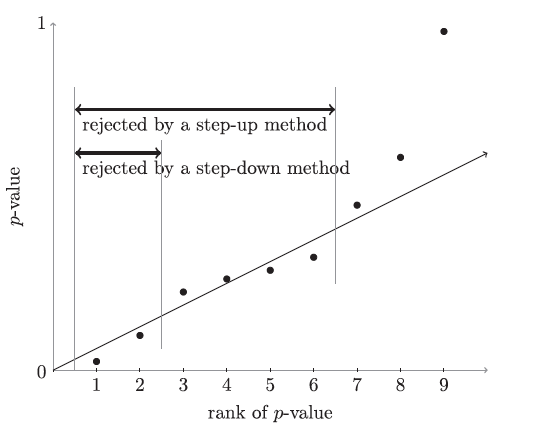

```{r startup, include = FALSE, message = FALSE, warning = FALSE}
knitr::opts_chunk$set(echo = T, eval=T, message=F, warning=F, error=F, 
                      comment=NA, cache=F, R.options=list(width=220),
                      fig.align='center', out.width='60%', fig.asp=.7)
```


# Outline

* False Discovery Rate

* Benjamini-Hochberg

* Benjamini-Yekutieli


---

# An alternative to the FWER

* The **False Discovery Rate** (FDR) is an an error control criterion developed in the 90's as an alternative to the FWER, which is usually employed in small-scale testing

* Now we are testing millions of hypotheses at once, and making a false discovery is not the end of the world

* The concept of FDR has changed thinking about multiple testing quite radically, showing that FWER control is not only way to do of multiple testing, and stimulating the field of multiple testing enormously

* FDR was introduced by Benjamini and Hochberg in 1995, and currently has 50K citations

* It is one of the [most-cited research of all time](https://www.nature.com/news/the-top-100-papers-1.16224)

---

# The False Discovery Rate

* The outcome of multiple testing is

|   | true  | false  | total  | 
|---|---|---|---|
| rejected  | $V$  | $U$  |  $R$ |
| not rejected   | $m_0-V$  |  $m_1-U$  | $m-R$   |
| total  | $m_0$  | $m_1$  | $m$  |

* The **false discovery proportion** (FDP) is defined as
$$Q = \frac{V}{\max(R,1)}$$
which is the proportion of false rejections among the rejections, defined as 0 if no rejections are made 

* The **false discovery rate** (FDR) is defined as
$$
\mathrm{FDR} = \mathbb{E}(Q)
$$

---

# FWER and FDR

* We have
$$
\mathrm{FWER} = \mathrm{P}(V > 0) = \mathrm{P}(Q > 0) \qquad \mathrm{vs} \qquad \mathrm{FDR} = \mathbb{E}(Q)
$$

* The two error rates FDR and FWER are related. Because $0 \leq Q \leq 1$, we have $$\mathbb{E}(Q) \leq \mathrm{Pr}(Q>0)$$ which implies that every FWER-controlling method is automatically also an FDR-controlling method

* Because FDR is smaller than FWER,  it is easier to keep the FDR below a level $\alpha$ than to keep the FWER below the same level, and we can generally expect FDR-based methods to have more power than FWER-based
ones

* Conversely, if all hypotheses are true, FDR and FWER are identical; because $R=V$ in this case, $Q$ is a Bernoulli random variable, and $\mathbb{E}(Q) = \mathrm{Pr}(Q >0)$

* Both FDR and FWER are proper generalizations of the concept of type I error to multiple hypotheses; if there is only one hypothesis ( $m=1$ ) the two error rates are identical, and equal to the regular type I error

---

* $Z_i \sim N(\mu_i,1)$ is the test statistic

* $H_i: \mu_i = 0$ vs $\bar{H}_i: \mu_i > 0$

* Reject $H_i$ if $p_i = 1-\Phi(Z_i) \leq \alpha$

```{r}
sim <- function(m, m0, effect) {
alpha = 0.05
stats <- rnorm(m)
stats[(m0+1):m] <- stats[(m0+1):m] + effect
pvals = pnorm(stats, lower.tail = FALSE)
setR <- which(pvals <= alpha)
# number of rejections
R = length(setR)
# number of type I errors
V <- sum( setR <= m0 )
# family-wise error
FWE <- (V > 0)
# false discovery proportion
FDP <- V/max(1,R)
return(c(R, V, FWE, FDP))
}
```

---

```{r}
set.seed(123)
res <- replicate(10, sim(100, 80, 2))
row.names(res) <- c("R","V","V>0", "V/R")
res
```

---

```{r}
set.seed(123)
res <- replicate(1000, sim(100, 80, 2))
rowMeans(res[3:4,]) # FWER and FDR
```

---

# Benjamini and Hochberg (1995) 

* Fix a level $\alpha \in (0,1)$

* Begin by ordering the p-values in ascending order
$$p_{(1)}\leq p_{(2)}\leq \ldots \leq p_{(m)}$$

* Let $i_{max}$ be be the largest $i$ for which
$$p_{(i)} \leq \frac{i \alpha}{m}$$

* Reject all $H_{(i)}$ with $i \leq i_{max}$

---

# BH threshold

```{r, echo=FALSE}
zscores <- read.csv("http://web.stanford.edu/~hastie/CASI_files/DATA/prostz.txt", header=F)$V1
pvalues <- 2*pnorm(abs(zscores), lower.tail = FALSE)
m = length(pvalues)
alpha = 0.05
plot(1:m, sort(pvalues), 
     xlim=c(0,50), ylim=c(0,.0005),
     xlab = "index i", ylab="p-value")
lines(1:m,(1:m*alpha)/m, col=2)
lines(1:m, rep(alpha/m,m), col=3)
```

---

# Step-down and step-up

* Holm is a step-down method

* BH is a step-up method




---

# BH controls the FDR

* For null p-values i.i.d $\mathrm{Uniform}(0,1)$, the Benjamini-Hochberg (BH) procedure controls the FDR at level $\alpha$. More precisely
$$\mathrm{FDR} = \frac{m_0}{m} \alpha \leq \alpha$$

* An interesting note is that the BH threshold is adaptive; it depends on the specific values of $p_{(1)} \leq p_{(2)}\leq \ldots \leq p_{(n)}$

* However, the BH procedure fails to control the FWER at $\alpha$

---

```{r}
sim <- function(m, m0, effect) {
alpha = 0.05
stats <- rnorm(m)
stats[(m0+1):m] <- stats[(m0+1):m] + effect
pvals = pnorm(stats, lower.tail = FALSE)
setR <- which(p.adjust(pvals,"BH") <= alpha)
# number of rejections
R = length(setR)
# number of type I errors
V <- sum( setR <= m0 )
# family-wise error
FWE <- (V > 0)
# false discovery proportion
FDP <- V/max(1,R)
return(c(R, V, FWE, FDP))
}
```

---

```{r}
set.seed(123)
res <- replicate(20, sim(100, 80, 2))
row.names(res) <- c("R","V","V>0", "V/R")
res
```

---

```{r}
set.seed(123)
res <- replicate(1000, sim(100, 80, 2))
rowMeans(res[3:4,]) # FWER and FDR
```

---

# FDR interpretation

* Consider what it means to control FDR: if we repeat our experiment many times, on average we control the FDP

* This is not a statement about our individual experiment, and does not say much
about the chance of having our FDP exceed a certain threshold other than the very weak bound
we can obtain via Markov's inequality:

$$\Pr(Q > \gamma) \leq \frac{\mathbb{E}(Q)}{\gamma}$$

* FWER, on the other hand, does control for an individual experiment. That is, with FWER control, we have no false discoveries unless we are very unlucky; with FDR control, on average our test will control FDP, but *this time* we may not have done a very good job


---

# Benjamini-Yekutieli (2001)

Under general dependence, the BH procedure controls at level $\alpha S(n)$, with 
$$S(m) = \sum_{i=1}^{m}\frac{1}{i} =  1 + 1/2 + 1/3 + \ldots + 1/m \approx \log m + 0.577$$
In fact
$$\mathrm{FDR} \leq \frac{m_0}{m} S(m)\alpha$$

The Benjamini-Yekutieli procedure (BY) finds $i_{max}$ be be the largest $i$ for which
$$p_{(i)} \leq \frac{i \alpha}{m S(m)}$$
and rejects all $H_{(i)}$ with $i \leq i_{max}$

---

# Positive regression dependence

* BH procedure controls the FDR under a notion of positive correlation between p-values. This form of dependence is known as *positive regression dependence on the subset of p-values of true null hypotheses* (PRDS)

* If the joint distribution of the $p$-values is PRDS, then the BH procedure controls the FDR at level $\frac{m_0}{m}\alpha$

